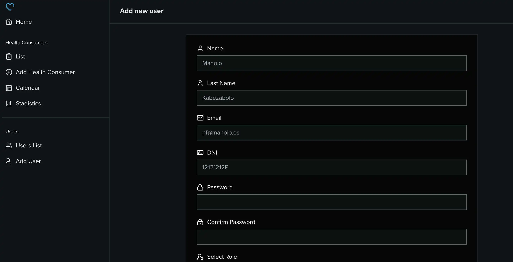

<div align="center">
    <h1>Dringen</h1>
    <br/>
    <p>This app is designed for managing patients and their clinical histories.</p>
    <br/>
</div>

<div align="center">
    
</div>

---

## Features

- Create and manage users. The following roles are currently available: 'user', 'medical office', 'physician' and 'admin'. Each role has its own capabilities. Patients are not included as users.
- Create and manage patients. Each patient has their own clinical history, statistics and related attachment files.
- Create and manage appointments.
- Use charts to display statistics about patients, such as their place of residence, gender, and diagnosis.
- The backend is built using Medplum.

## Technologies

- React.
- Typescript.
- Vite.
- Vitest.
- TanStack Query.
- TanStack Router.
- TanStack Table.
- Taildwind.
- Shadcn/ui.
- React hook form.
- React Big Calendar.
- Medplum.

## Documentation

### Installation

1. Clone this repo

```bash
$ git clone git@github.com:antoniofelices/dringen.git .
```

2. Install packages

```bash
$ npm install
```

3. Run develop

```bash
$ npm run dev
```

## Future Improvements

- The database structure should be refactored.
- Implement some standard, such as HL7 FHIR, to ensure data is shared securely and efficiently.
- Improve dashboard screen.

## Contributing

Please feel free to send pull requests and raise issues.
Any contributions you make will be under the MIT license.
Therefore, when you submit code changes, they are understood to be covered by the same licence.

### Code of Conduct

Studio Moare has adopted the Contributor Covenant Code of Conduct that we expect project participants to adhere to. [Please read the full text](https://www.contributor-covenant.org/version/2/1/code_of_conduct/code_of_conduct.md) so that you can understand what actions will and will not be tolerated.

## License

© 2025+, Antonio Felices. Released under the [MIT licence](./LICENSE).
